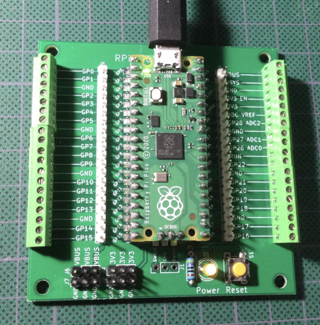

# PiPico_Breakout
RPi Pico Breakout board  
  

This breakout board provides labeled RPi headers including extra 3.3V, VBUS and GND pins. 
There is also a power LED and a convenient reset button for the Pi Pico.    
Pi Pico KiCad symbols and footprints are from https://github.com/ncarandini/KiCad-RP-Pico  
Pi Pico Datasheet:  https://datasheets.raspberrypi.com/pico/pico-datasheet.pdf  
